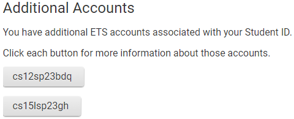
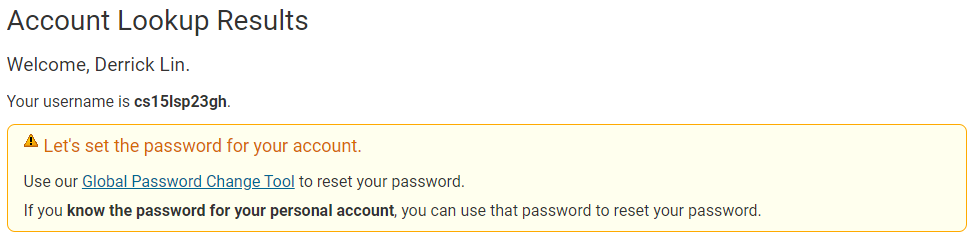
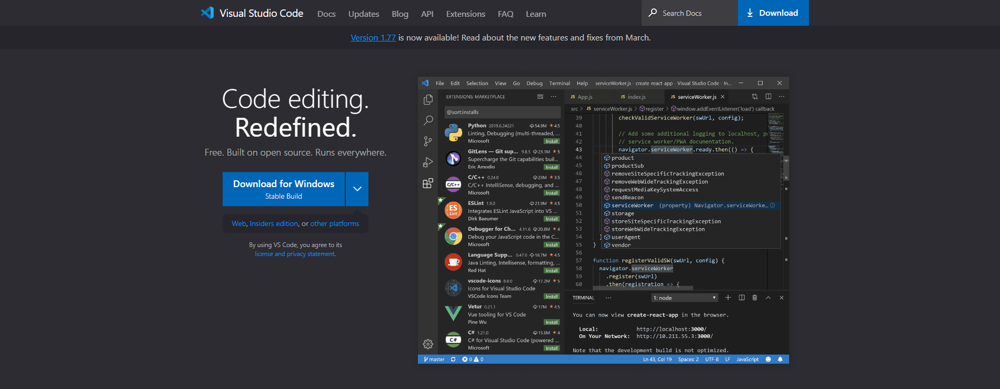
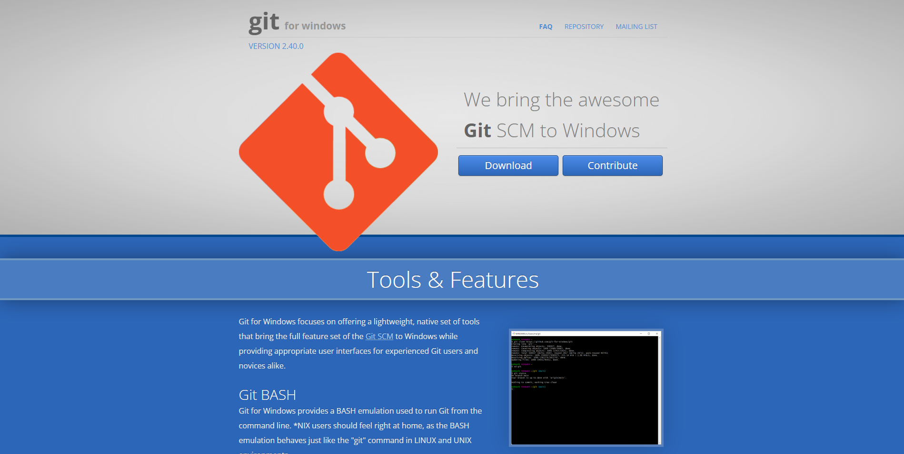
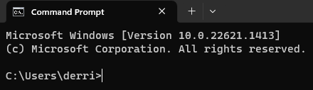
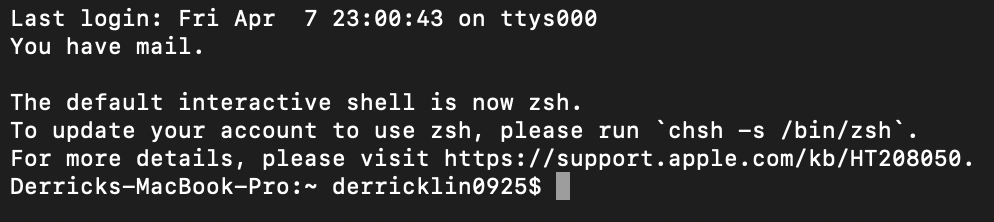
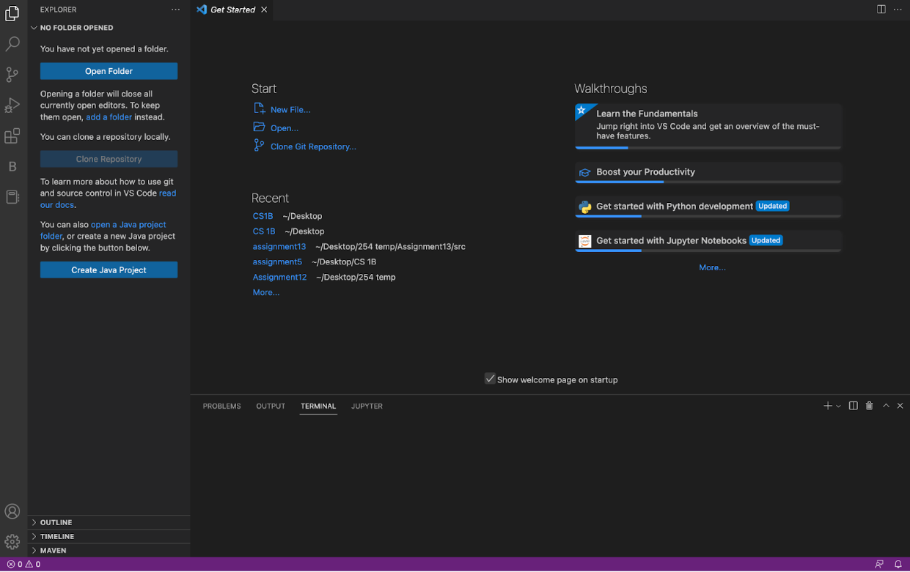
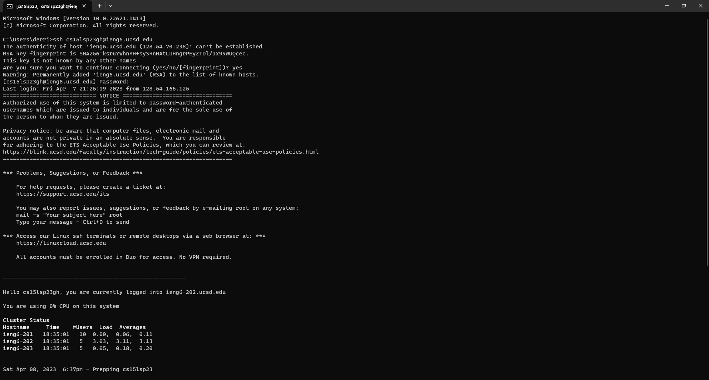
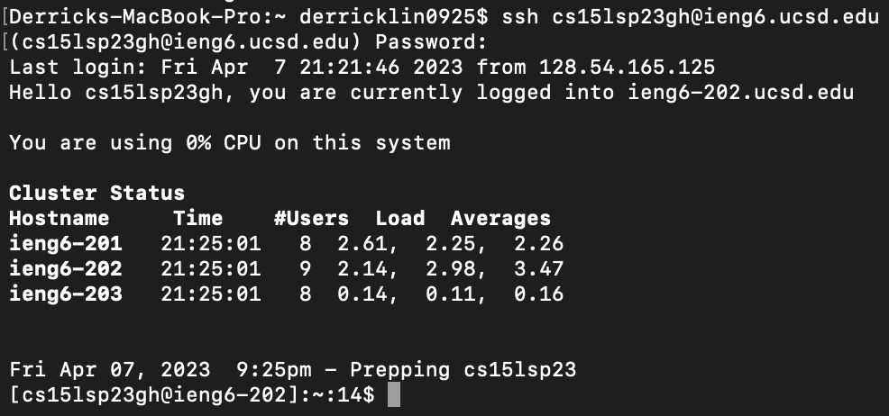
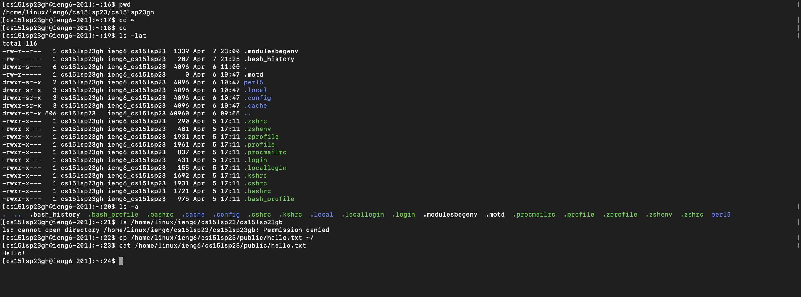

## **Lab Report 1**
---
Published April 8th, 2023, by Derrick Lin

---
Hey everyone! I'm Derrick and today I'll be guiding you through **remote access and filesystem** in CSE 15L. Before we begin remotely connecting, you will have to:
1. Lookup your course-specific account, log into your CSE 15L account, and change the password
2. Install VScode(Visual Studio Code) and git(if on Windows)
---
# **Step 1**
In order to lookup your course-specific account, you will have to go to this <a href="https://sdacs.ucsd.edu/~icc/index.php "> page </a> and enter the following:

> *username: **xxx**@ucsd.edu* (only enter the bolded part of your email)
>
> *Student ID: **your PID** *

Once you login, you will see:

Now that you see this, click on the account for the corresponding course (in this case, it would be the one starting in **cs15l...**. You should see this:

Click on **Global Password Change Tool** and click **Proceed to the Password Change Tool** under the **Student, AX, or Course-Specific Student Accounts** section. Once you are there, follow the instructions and change your password.

---
# **Step 2**
**VScode** is an IDE (integraded development environment) that we can write and run code on. For the purpose of this tutorial, we will only be using the Terminal found within VScode. **Please note that using the Terminal on your computer works as well**.

To install VScode, click <a href="https://code.visualstudio.com/"> here </a>.
You will be taken to a screen that looks like:

Once you are there, select the proper installation for your device (Windows, Mac, Linux)

To download git, click <a href="https://gitforwindows.org/"> here </a>.
You will be taken to a screen that looks like:

We want to install git if on Windows because commands are different between Windows and Mac/Linux. Installing **git** allows us to use Mac/Linux commands on Windows.

Follow steps <a href="https://stackoverflow.com/questions/42606837/how-do-i-use-bash-on-windows-from-the-visual-studio-code-integrated-terminal/50527994#50527994"> here </a> to set default terminal to **git bash** in VScode.

> *Credit to Professor Politz for link above.*

**Now it's time to dive into remotely connecting.**

---
# **Remote Access and Filesystem**
In order to start remote access, we will need to open up either our **Command Prompt/Terminal** or **VScode**

**Command Prompt (Windows) looks like:**

**Terminal looks like:**

**VScode looks like:**

Once you get either application open, enter:
**`ssh cs15lsp23zz@ieng6.ucsd.edu`**, with the **`zz`** being your specific number.

You will be asked to enter a password, that password will be whatever you set it to in the earlier steps. **Note that when you type in your password it will appear as if you haven't typed in anything, but the terminal hides your password on purpose**.

It should look like this (on Command Prompt because I have logged in previously on Terminal (Mac), *Terminal for Windows*:

This is what it looks like if you have logged in (Terminal on mac):

Once you are in you can run a few commands to test it out. There are several commands, we will test out:
- **`cd`** **Command for changing directory**
- **`ls -lat`** **Shows a list of files in the directory + time they were added**
- **`ls -a`** **Shows more detailed descriptions of what files are in the directory**
- **`ls **directory*** */home/linux/ieng6/cs15lsp23/cs15lsp23**abc** where **abc** is one of your other group members' username`** **Here we try to access someone else's account files**
- **`cp /home/linux/ieng6/cs15lsp23/public/hello.txt ~/`** **Copies this file**
- **`cat /home/linux/ieng6/cs15lsp23/public/hello.txt`** **Prints the file content**

Here is a screenshot of those commands and their respective outputs:

In this screenshot, I am running the commands I listed above and showing the corresponding output matching the descriptions of the commands.

If you want to log out of the remote server in your terminal, you can use either **Ctrl-D** or **Exit** in the terminal to leave.

That will be the end of my tutorial! Thank you all for taking the time to read this! If you have any corrections or issues with the article, please contact me at **del021@ucsd.edu**
