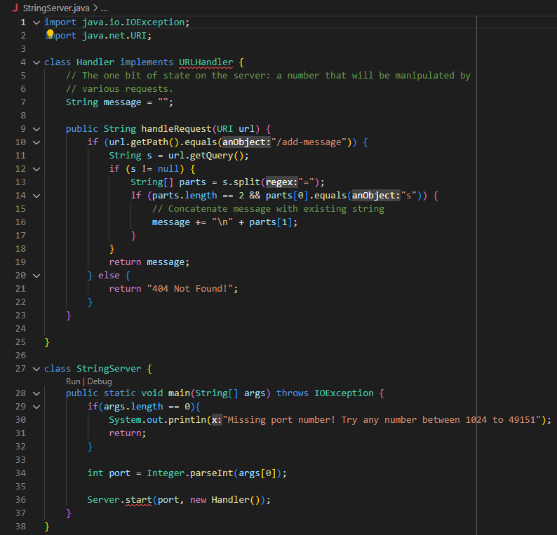
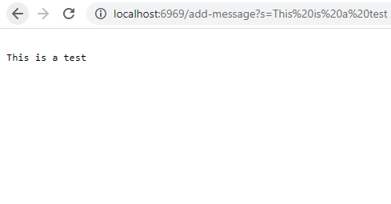
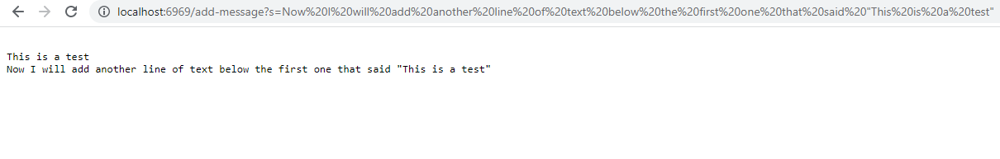
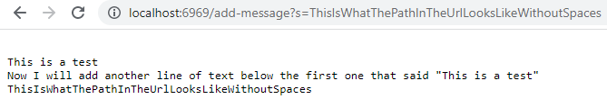
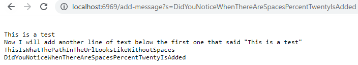
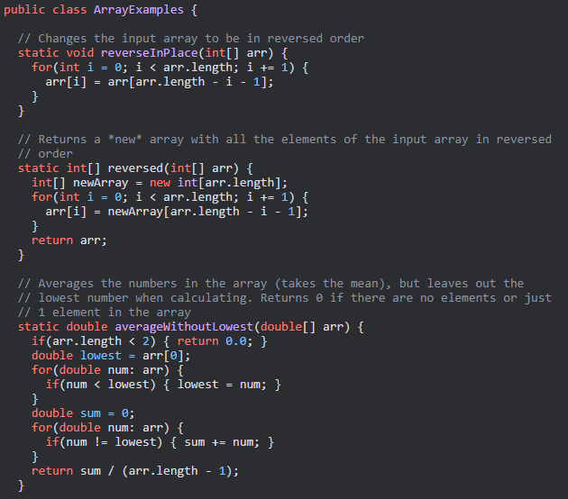
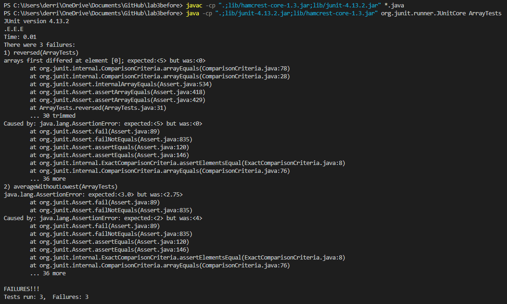
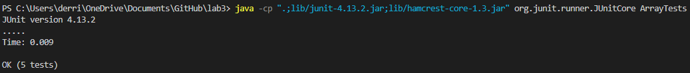

## **Lab Report 2**
---
Published April 23rd, 2023, by Derrick Lin

---
Hey everyone! I'm Derrick and today I'll be guiding you through **servers and bugs** in CSE 15L. I will be going over the following:
1. What a server that concatenates strings looks like on a server
2. Bugs in the code from lab 3 and how we test and fix them
3. Something I learned from lab week 2 or 3 that I didn't know before
---
# **Step 1**
**I've written a web server and called it StringServer. What it does when I run it with a port number, it has the ability to add strings to the line below the previous line. I will explain further in a bit! Here is the code that I wrote which allows said functions to be done:**


In the code above, I've set it so that adding a path like **`/add-message?s=<string>`** after our domain outputs the string we typed onto the web page.



**Notice that in the URL, there were a bunch of %20s in between my text. You can include that as a space in the text, but if you type the string out with a space, %20 will autofull in those positions when you press enter.**

**I've added a different path and hit enter to show how it concatenates strings, the code I wrote added the first line + this second line**



**This is what the path and output look like without any spaces:**


**This is just an extra image explaining the %20 I've explained above.**


In the screenshot of the StringServer class I posted above, the handleRequest method is called. It's called when 
`/add-message?s=<string>` is added as a path after the domain. The Server.start() method is also called, it's from another class called Server, and it starts the server and waits for incoming connections on a specified port number. Lastly, the main() method in the StringServer class is called to execute the program and pass the port number argument we give it.

The relevant arguments to the handleRequest method are the URI object representing the request URL. The relevent field of the Handler class is the StringBuilder object messages, which represents the accumulated messages received from previous requests. Its value changes when a new message is typed in with the `/add-message?s=<string>` block.

The values of the messages field of the Handler class change from specific request `/add-message?s=<string>`. The messages field is a StringBuilder object that represents the acucmulated messages received from previous requests. Inside the if block for the path to add a new message, the code appends the new message to the messages field. Therefore, the messages field is modified to include the new message from the current request. If the "s" query parameter is not present in the URL, the code does not modify the messages field. If there is no "s" in the URL, the code will return an error message. If our path **/add-message** is not in the URL, the if block in our StringServer class will not be executed and the code will check other possible paths in the handleRequest method.

Now that we know how StringServer works, lets move onto bugs from lab 3!

---
# **Step 2**
There were a variety of bugs from lab 3, today we will be looking at bugs within ArrayExamples.java!

**The buggy code for ArrayExamples.java is here:


To start, we have three methods, **reverseInPlace, reversed, and averageWithoutLowest**. I've written test methods in an ArrayTest class and provided tests below that should induce failures because there are bugs in the three methods above:

**Test that makes reverseInPlace fail:** 

```
@Test

  public void reverseInPlace() {
  
    int[] input1 = {2, 3, 4};
    
    ArrayExamples.reverseInPlace(input1);
    
    assertArrayEquals(new int[]{4, 3, 2}, input1);
    
  }
```

**Test that makes reversed fail:** 

```
@Test

  public void reversed() {
  
    int[] input1 = {1, 2, 3, 4, 5};
    
    assertArrayEquals(new int[] {5, 4, 3, 2, 1}, ArrayExamples.reversed(input1));
    
  }
```

**Test that makes averageWithoutLowest fail:** 

```
@Test

  public void averageWithoutLowest() {

    // what if multiple instances of lowest? only drop one instance of the lowest
    
    double[] input1 = {1.0, 1.0, 2.0, 3.0, 6.0};
    
    assertEquals(3.0, ArrayExamples.averageWithoutLowest(input1),0);

  }
```

When these tests are ran in the ArrayTests class, we get this from output from our terminal:



Additionally, the symptoms are shown too. We are told which test failed and why **(expected does not match actual output)**.

We can write more simple test cases that will actually not induce a failure, those test cases would be:

**Test that makes reverseInPlace pass:** 

```
@Test 

	public void testReverseInPlace() {
  
    int[] input1 = { 3 };
    
    ArrayExamples.reverseInPlace(input1);
    
    assertArrayEquals(new int[]{ 3 }, input1);
    
	}
```

**Test that makes reversed pass:** 

```
@Test

  public void testReversed() {
  
    int[] input1 = { };
    
    assertArrayEquals(new int[]{ }, ArrayExamples.reversed(input1));
    
  }
```

**Test that makes averageWithoutLowest pass:** 

```
@Test

  public void averageWithoutLowest() {
    
    double[] input1 = {0.0, 1.0};
    
    assertEquals(1.0, ArrayExamples.averageWithoutLowest(input1),0);

  }
```

Below is a screenshot from the terminal that shows that all tests have passed **(doesn't induce a failure)**.



Now that we have tested cases that pass and fail, we can correct the code to make the cases that fail pass.

For a comparison, here is the code once again before fixing the bugs:

```
public class ArrayExamples {

  // Changes the input array to be in reversed order
  
  static void reverseInPlace(int[] arr) {
  
    for(int i = 0; i < arr.length; i += 1) {
    
      arr[i] = arr[arr.length - i - 1];
      
    }
    
    
  }


  // Returns a *new* array with all the elements of the input array in reversed
  
  // order
  
  static int[] reversed(int[] arr) {
  
    int[] newArray = new int[arr.length];
    
    for(int i = 0; i < arr.length; i += 1) {
    
      arr[i] = newArray[arr.length - i - 1];
      
    }
    
    return arr;
    
  }
  
  
  // Averages the numbers in the array (takes the mean), but leaves out the
  
  // lowest number when calculating. Returns 0 if there are no elements or just
  
  // 1 element in the array
  
  static double averageWithoutLowest(double[] arr) {
  
    if(arr.length < 2) { return 0.0; }
    
    double lowest = arr[0];
    
    for(double num: arr) {
    
      if(num < lowest) { lowest = num; }
      
    }
    
    double sum = 0;
    
    for(double num: arr) {
    
      if(num != lowest) { sum += num; }
      
    }
    
    return sum / (arr.length - 1);
    
  }
  
}
```

Here is the corrected code I've wrote to make all the cases test cases not induce a failure:

```
public class ArrayExamples {

  // Changes the input array to be in reversed order
  
  /*
  
   * added / 2 to the array length that our int i uses as a condition, created a
   
   * temporary array to be our reversed array, and set our array equal to the
   
   * reversed temp array 
   
   */


  static void reverseInPlace(int[] arr) {
  
    for(int i = 0; i < arr.length / 2; i += 1) {
    
      int temp = arr [i];
      
      arr[i] = arr[arr.length - i - 1];
      
      arr[arr.length - i - 1] = temp;
      
    }
    
  }
  
  
  // Returns a *new* array with all the elements of the input array in reversed
  
  // order
  
  /*
  
   * fixed, set arr equal to the array made in the loop, then set newArray = arr
   
   */
   
  static int[] reversed(int[] arr) {
  
    int[] newArray = new int[arr.length];
    
    for(int i = 0; i < arr.length; i += 1) {
    
      newArray[i] = arr[arr.length - i - 1];
      
    }
    
    return newArray;
    
  }
  


  // Averages the numbers in the array (takes the mean), but leaves out the
  
  // lowest number when calculating. Returns 0 if there are no elements or just
  
  // 1 element in the array
  
  /*
  
   * fixed to where if there's 2 instances of the lowest, we will subtrct one
   
   * instance of the lowest before finding the average
   
   */
   
  static double averageWithoutLowest(double[] arr) {
  
    if(arr.length < 2) { return 0.0; }
    
    double lowest = arr[0];
    
    for(double num: arr) {
    
      if(num < lowest) { lowest = num; }
      
    }
    
    double sum = 0;
    
    for(double num: arr) {
    
      //if(num != lowest) { sum += num; }
      
      sum += num;
      
    }
    
    return (sum - lowest) / (arr.length - 1);
    
  }
  

}
```

