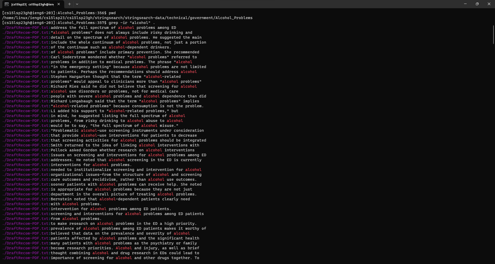
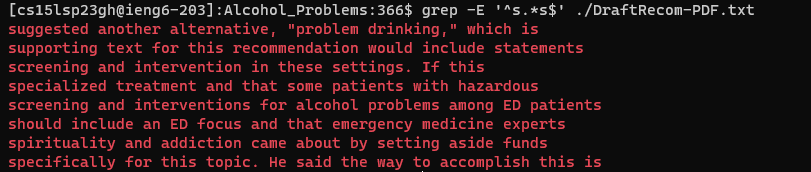
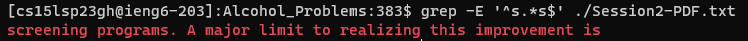
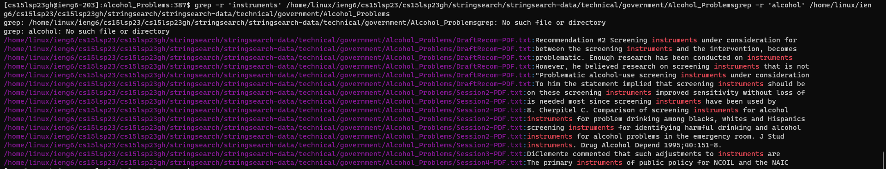
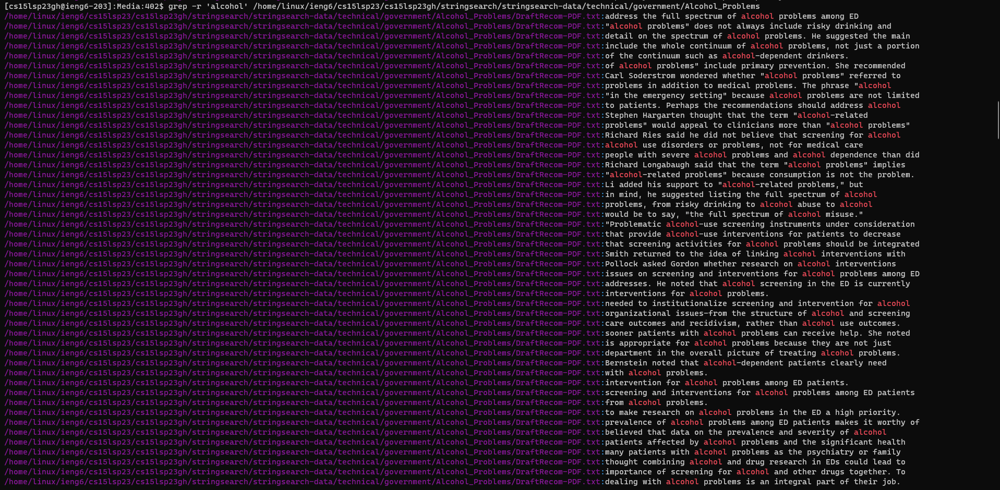
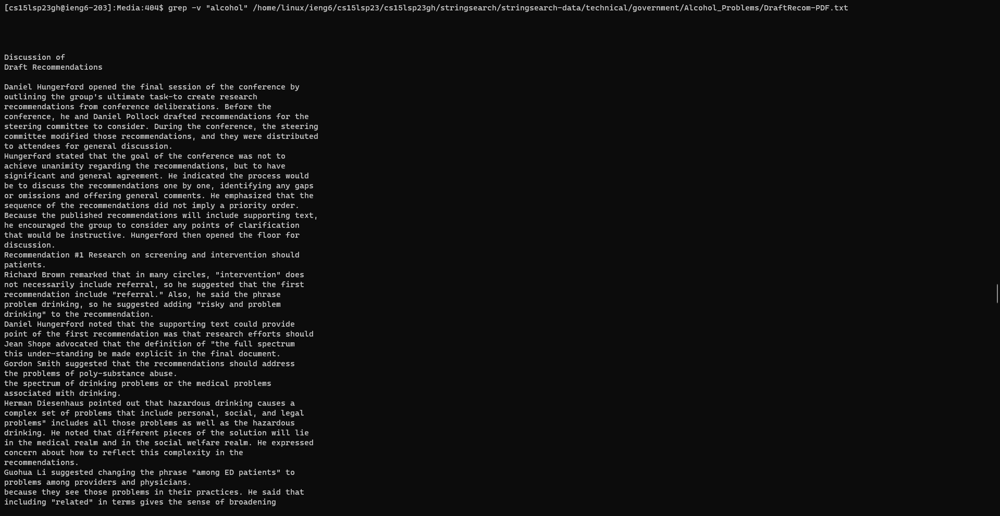
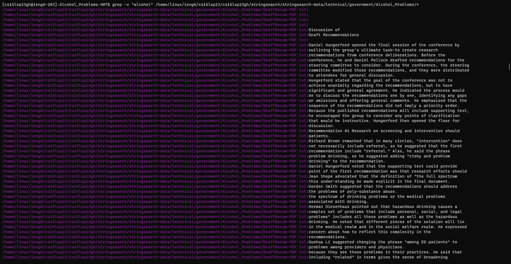

## **Lab Report 3**
---
Published May 9th, 2023, by Derrick Lin

---
Hey everyone! I'm Derrick and today I'll be guiding you through commands in CSE 15L. There are a few interesting commands, `less`, `find`, and `grep`. Today we will take a deeper look and dive into the command **`grep`**!

We will be going over:
Four interesting command-line options or alternate ways to use **`grep`** as well as a few examples for each new option found on files and directories from `./technical`, which was a directory given in the CSE 15L stringsearch-data folder. The command `grep` by itself is used to search for a string in a given file or directory, but we will be exploring the various ways that can modify or filter the search.

---
# **Alternate ways to use `grep`**
There are a variety of ways one can use commands, I've looked online and found a few ways.

Here are four different ways to use `grep`:
- <a href="https://www.gnu.org/software/grep/manual/html_node/Matching-Control.html"> `grep -i 'string' fileName.txt` </a>: (this allows us to search for a string in a given file)
- <a href="https://linuxize.com/post/how-to-use-grep-command-to-search-files-in-linux/"> `grep -E '^s.*s$' ./file.txt` </a>: (allows us to search for a line that starts with something and ends with something specific)
- <a href="https://www.geeksforgeeks.org/grep-command-in-unixlinux/#"> `grep -r 'string' /path/to/directory` </a>: (searches for a string recursively in the directory and prints all lines that contain the string)
- <a href="https://man7.org/linux/man-pages/man1/grep.1.html"> `grep -v "string" ./file.txt` </a>: (searches a given file or directory for lines that exclude the string)

---
# **Examples of new ways to use `grep`**

**Examples of using `grep -i "string" fileName.txt`:**
- `grep -i "alcohol" DraftRecom-PDF.txt`
This command searches for the string "alcohol" in the file. Now you may think that this is the same as `grep`, but the "-i" allows us to not care about case sensitivity. This means our command will search for the string alcohol, Alcohol, alCohol, etc. 

In order to use `grep -i` on a directory, it must be changed to "**ir**":
- grep -ir "alcohol" .

**Examples of using `grep -E '^s.*s$' ./file.txt`:**
- `grep -E '^s.*s$' ./DraftRecom-PDF.txt`

other example of grep -E with another .txt in .technical:
- `grep -E '^s.*s$' ./Session2-PDF.txt`

**Examples of using `grep -r 'string' /path/to/directory`:**
- `grep -r 'instruments' /home/linux/ieng6/cs15lsp23/cs15lsp23gh/stringsearch/stringsearch-data/technical/government/Alcohol_Problems`

second grep -r:
- `grep -r 'alcohol' /home/linux/ieng6/cs15lsp23/cs15lsp23gh/stringsearch/stringsearch-data/technical/government/Alcohol_Problems`

**Examples of using `grep -v "string" ./file.txt`:**
- `grep -v "alcohol" /home/linux/ieng6/cs15lsp23/cs15lsp23gh/stringsearch/stringsearch-data/technical/government/Alcohol_Problems/DraftRecom-PDF.txt`

second grep -v (shows lines excluding "alcohol" in every .txt file within that directory:
- `grep -v "alcohol" /home/linux/ieng6/cs15lsp23/cs15lsp23gh/stringsearch/stringsearch-data/technical/government/Alcohol_Problems/*`

