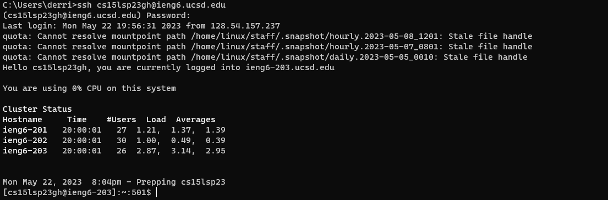
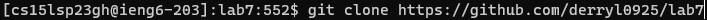
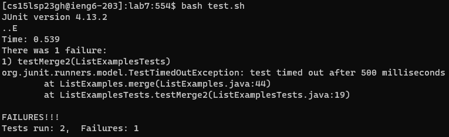
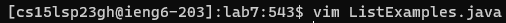
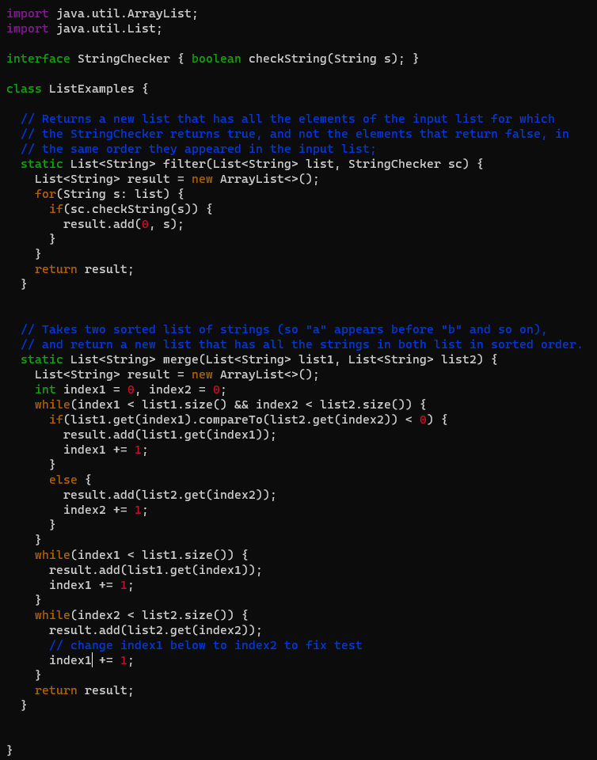
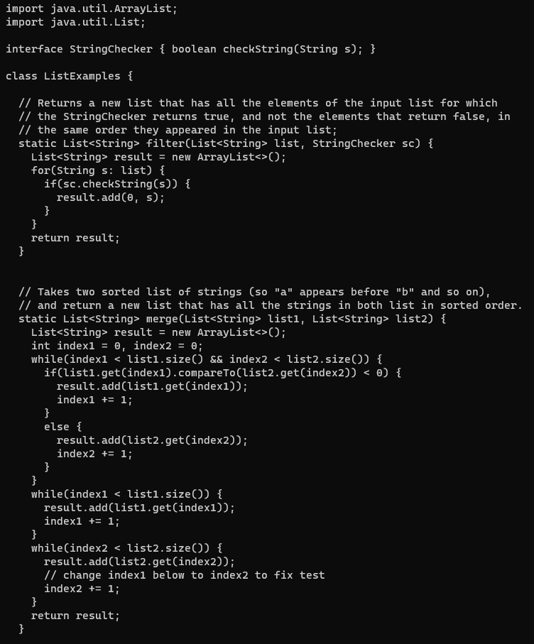
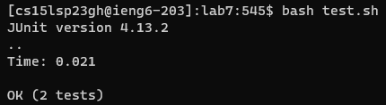
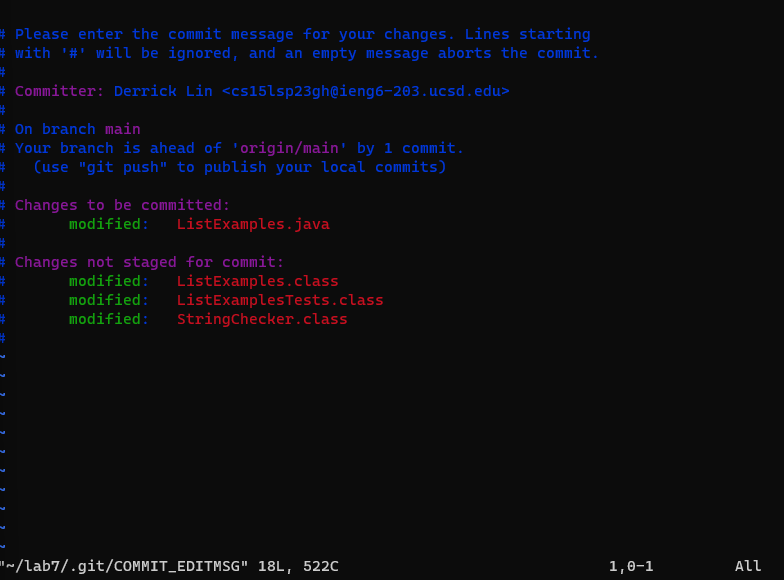
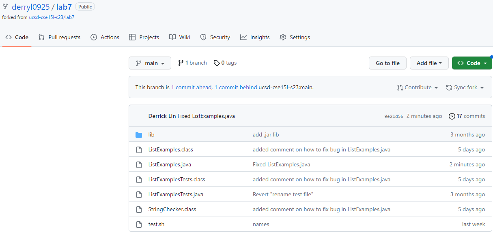
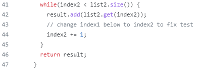

## **Lab Report 4**
---
Published May 22th, 2023, by Derrick Lin

---
Hey everyone! I'm Derrick and today I'll be through a few commands! A few of which will be done in **Vim**. 

We will be going over steps 4-9 in lab 7:

4. Log into ieng6

5. Clone your fork of the repository from your Github account

6. Run the tests, demonstrating that they fail

7. Edit the code file to fix the failing test

8. Run the tests, demonstrating that they now succeed

9. Commit and push the resulting change to your Github account (you can pick any commit message!)

---
# **Step 4: Logging into ieng6**
So by now, if you have been paying attention during lab, you should know how to do this, but to those who don't:

1. Open your terminal on your desktop or in VsCode
2. type `shh cs15lsp23xx@ieng6.ucsd.edu`
3. Enter your password (this step can be skipped with the instructions making an ssh key in lab 7)

Once you log in, you should be prompted a screen showing that you have logged in, now we can move onto the next step!

---
# **Step 5: Cloning a fork of a repository from your personal Github account**
Throughout the entirety of this course, we have forked many repositories from TAs, staff, and from Prof. Politz. Now it's our turn! We will be forking the repository to our own Github accounts then cloning the repository from our personal account. There is a slight change though... 

In order to properly clone our repository and allow commits and pushes, we must use `git clone git@github.com:username/reponame.git`. The instructions to properly set up SSH Keys for Github can be found <a href="https://ucsd-cse15l-s23.github.io/week/week7/> here </a>.

In order to do this, we will do the following:
1. Visit <a href="https://github.com/ucsd-cse15l-s23/lab7"> this page </a> to find the repository we want to fork.
2. Then click fork at the top right and bring it into your own account.
3. Now that we have the forked repository on our account, we can run `git clone https://github.com/username/lab7` to clone a copy onto our remote server account.
4. **additional step if you already have a cloned repository and you want to remove it: type `rm -rf directoryName` *8

**The exact keystrokes to complete this step (after forking repository):**
git clone https://github.com/username/lab7 <enter> 

---
# **Step 6: Run the tests, demonstrating that they fail**
There won't be much to do here but to run our shellscript `bash test.sh` and watch as it tells us there was a failed test.

**The exact keystrokes to complete this step:**
bash test.sh <enter>
  
  
---
# **Step 7: Edit the code file to fix the failing test**
This is where the fun begings! We will utilize **Vim**, a text editor.

If you would like to learn about Vim, typing the command `vimtutor` pulls up a tutorial you can follow to learn Vim.

In order to edit the file to fix the failing test, we will:
1. Open ListExamples.java using vim: `vim ListExamples.java`
  
2. Navigate to the last while loop using hjkl to go left, down, up, and right
  
3. Pressing "i" to enter Insert Mode then make the change required (index1 --> index2)
4. We then press <esc> to return to normal mode, **:wq** to save and quit, then `cat ListExamples.java` to see if our changes saved successfully.

---
# **Step 8, Run the tests, demonstrating that they succeed**
We will run our shellscript `bash test.sh` and watch as it tells us the tests succeeds.

**The exact keystrokes to complete this step:**
bash test.sh <enter>
  
---
# **Step 9, Commit and Push changes to Github**
In order to commit and push our changes to our Github, we will type first `git commit filename`. this brings us to a screen where we can use vim commands ("i" for insert mode) to type a commit message)

  
From there, we enter `git push origin main` to finish up the steps to commit and push our changed file.

You can check your Github repository for lab7 and see that the changes were successfully made!

**The exact keystrokes to complete this step:**
`git commit ListExamples.java` <enter> :wq `git push origin main` <enter>
  
---
  
This lab is really important as we learned how to use Vim and practiced committing and pushing to our Github repositories through the terminal. I hope you enjoyed reading through my tutorial! Please contact me at del021@ucsd.edu if you have any questions or concerns.
  
