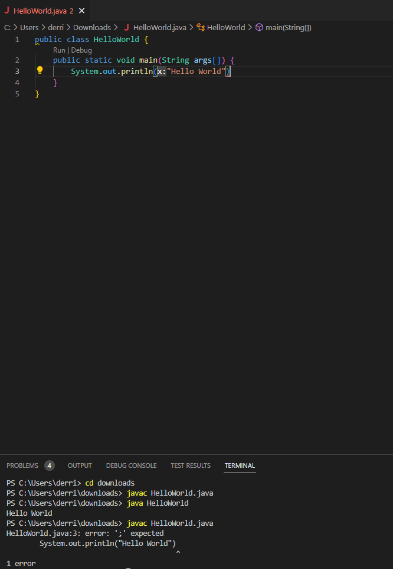

## **Lab Report 5**
---
Published June 5th, 2023, by Derrick Lin

---
Hey everyone! I'm Derrick and today I'll be walking you through a typical debugging scenario and how it plays out.

We will first go over how you should ask your question, then a typical response from a TA that hopefully resolves your issue.

---
# **How to ask your question**
When asking your question, there needs to be specific details given in order for others to help you. Those details could be your opertaing system, screenshots, and more!

I've written a mock post on EdStem asking for help:
**`What environment are you using (computer, operating system, web browser, terminal/editor, and so on)?`**

Windows 11 desktop, Visual Studio Code

**`Detail the symptom you're seeing. Be specific; include both what you're seeing and what you expected to see instead. Screenshots are great, copy-pasted terminal output is also great. Avoid saying "it doesn't work".`**

I am seeing an error, the program is supposed to print "Hello World" but my file won't compile successfully.

**`Detail the failure-inducing input and context. That might mean any or all of the command you're running, a test case, command-line arguments, working directory, even the last few commands you ran. Do your best to provide as much contet as you can.`**

I think the failure inducing input comes from my System.out.print line, which is line 3. When I type "javac HelloWorld.java" my error occurs.

---
# **TA response**
After reviewing through your post on EdStem for help, either your instructor or a TA will respond. The response typically conststs of:
- Asking a follow up question for clarification or suggesting a command

A response to my question could be:
Hey Derrick, I see that your terminal outputs reasons as to why the compilation of your code fails. It actually tells you that ; is expected in line 3, where your System.out.print line is. You could try writing line 3 as
`System.out.println("Hello World");` and it should work. 

Why don't you do ahead and try it out, if more issues occur, feel free to create another post on EdStem or respond to this reply!

\- TA 

---

This lab is important as we learn how to ask for help and create a post on EdStem. Having tutors or TAs look at your work to help you is one of the key resources every college student should be utilizing! I hope you enjoyed reading through my tutorial! Please contact me at del021@ucsd.edu if you have any questions or concerns.

